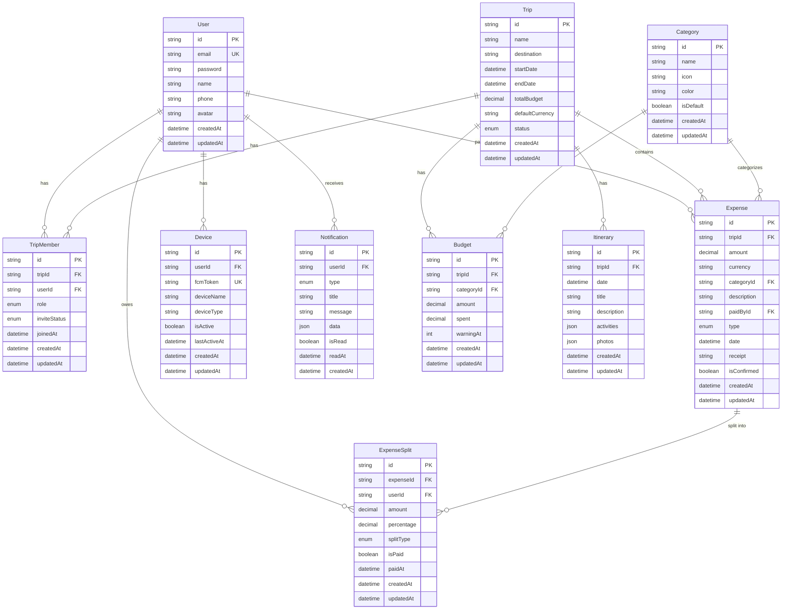

# Database Entity Relationship Diagram

Sơ đồ quan hệ cơ sở dữ liệu cho Travel Expense Management App

---

## ERD Diagram (Mermaid)



---

## Giải thích mối quan hệ

### 1. User (Người dùng)

- **1:N với TripMember**: Một user có thể tham gia nhiều chuyến đi
- **1:N với Expense**: Một user có thể trả tiền cho nhiều chi tiêu
- **1:N với ExpenseSplit**: Một user có thể nợ nhiều khoản chi tiêu
- **1:N với Device**: Một user có thể đăng nhập nhiều thiết bị
- **1:N với Notification**: Một user nhận nhiều thông báo

### 2. Trip (Chuyến đi)

- **1:N với TripMember**: Một chuyến đi có nhiều thành viên
- **1:N với Expense**: Một chuyến đi có nhiều chi tiêu
- **1:N với Budget**: Một chuyến đi có nhiều ngân sách (tổng + theo danh mục)
- **1:N với Itinerary**: Một chuyến đi có nhiều lịch trình theo ngày

### 3. Category (Danh mục)

- **1:N với Expense**: Một danh mục có nhiều chi tiêu
- **1:N với Budget**: Một danh mục có thể có ngân sách riêng

### 4. Expense (Chi tiêu)

- **N:1 với Trip**: Nhiều chi tiêu thuộc một chuyến đi
- **N:1 với Category**: Nhiều chi tiêu thuộc một danh mục
- **N:1 với User** (paidBy): Nhiều chi tiêu được trả bởi một user
- **1:N với ExpenseSplit**: Một chi tiêu được chia cho nhiều người

### 5. ExpenseSplit (Phân chia chi phí)

- **N:1 với Expense**: Nhiều split thuộc một chi tiêu
- **N:1 với User**: Nhiều split thuộc về một user

### 6. Budget (Ngân sách)

- **N:1 với Trip**: Nhiều budget thuộc một chuyến đi
- **N:1 với Category** (optional): Budget có thể theo danh mục hoặc tổng

### 7. Itinerary (Lịch trình)

- **N:1 với Trip**: Nhiều lịch trình thuộc một chuyến đi

### 8. Notification (Thông báo)

- **N:1 với User**: Nhiều thông báo gửi đến một user

### 9. Device (Thiết bị)

- **N:1 với User**: Nhiều thiết bị thuộc một user

---

## Các ràng buộc quan trọng

### Unique Constraints

- `User.email` - Email phải unique
- `Device.fcmToken` - FCM token phải unique
- `TripMember(tripId, userId)` - Một user chỉ tham gia một lần vào một trip
- `ExpenseSplit(expenseId, userId)` - Một user chỉ có một split trong một expense

### Cascade Delete

- Khi xóa **Trip** → xóa tất cả TripMember, Expense, Budget, Itinerary liên quan
- Khi xóa **Expense** → xóa tất cả ExpenseSplit liên quan
- Khi xóa **User** → xóa tất cả Device, Notification liên quan

### Enums

- **TripStatus**: UPCOMING, ONGOING, COMPLETED, ARCHIVED
- **MemberRole**: OWNER, MEMBER
- **InviteStatus**: PENDING, ACCEPTED, REJECTED
- **ExpenseType**: SHARED, PERSONAL
- **SplitType**: EQUAL, PERCENTAGE, AMOUNT
- **NotificationType**: TRIP_INVITE, MEMBER_JOINED, EXPENSE_CREATED, BUDGET_WARNING, SETTLEMENT_REMINDER, EXPENSE_REMINDER

---

## Xem diagram trong VS Code

### Cài đặt extension:

1. **Markdown Preview Mermaid Support** - Preview Mermaid trong VS Code
2. **Mermaid Markdown Syntax Highlighting** - Syntax highlighting

### Xem diagram:

- Mở file này trong VS Code
- Nhấn `Ctrl + Shift + V` (Windows) hoặc `Cmd + Shift + V` (Mac) để xem preview
- Diagram sẽ được render tự động

---

## Export diagram

### Online Tools:

1. **Mermaid Live Editor**: https://mermaid.live
   - Copy mermaid code và paste vào
   - Export PNG, SVG, hoặc PDF

2. **dbdiagram.io**: https://dbdiagram.io
   - Công cụ chuyên về database diagram
   - Có thể import Prisma schema

### CLI Tools:

```bash
# Install mermaid-cli
npm install -g @mermaid-js/mermaid-cli

# Generate PNG
mmdc -i database-diagram.md -o database-diagram.png

# Generate SVG
mmdc -i database-diagram.md -o database-diagram.svg
```

---

## Prisma Studio

Bạn cũng có thể xem database schema bằng Prisma Studio:

```bash
# Chạy Prisma Studio
npx prisma studio
```

Prisma Studio sẽ mở trình duyệt và hiển thị:

- Tất cả tables/models
- Relationships giữa các bảng
- Dữ liệu trong database
- GUI để CRUD dữ liệu

URL mặc định: `http://localhost:5555`

---

## Các công cụ khác

### 1. TablePlus / DBeaver

- Kết nối trực tiếp vào PostgreSQL
- Xem ERD tự động từ database thực tế
- Export diagram dạng ảnh

### 2. Draw.io / Lucidchart

- Vẽ ERD thủ công với UI đẹp
- Export nhiều format

### 3. PlantUML

- Tạo diagram bằng code (tương tự Mermaid)
- Tích hợp tốt với documentation

---

_Ghi chú: File này chứa ERD diagram cho Travel Expense Management App_
